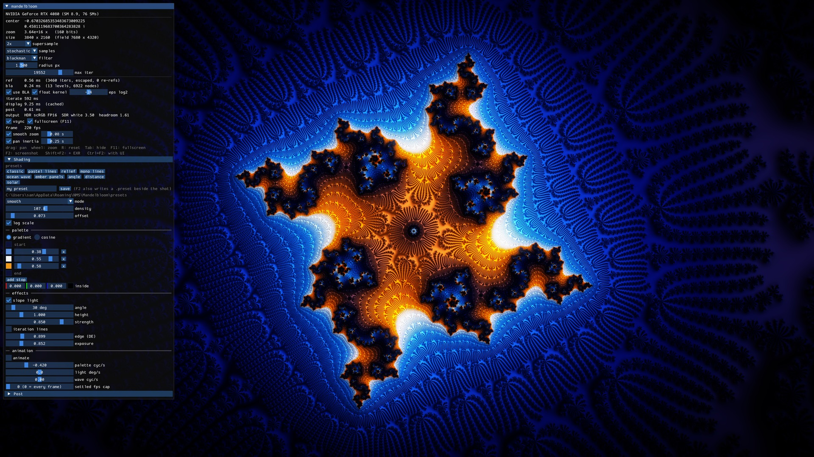

# mandelbloom



The cover, reproducible (the preset is `docs/cover.preset`):

```
mandelgpu.exe -0.67032685353483673009225 0.4581119683700364283828 2.29e-20 19552 --ss 2 --aa 2,3,1.5 --loadfile docs\cover.preset
```

GPU Mandelbrot viewer for Windows, built for 4K HDR and smooth deep zooms. CUDA does the iteration, SDL3 and Dear ImGui
do the window and UI, Direct3D 12 presents an FP16 scRGB swapchain (HDR on
HDR displays) that CUDA writes into directly through a shared buffer.

## How it renders

1. The view centre is an MPFR number. Its precision follows the zoom.
2. The CPU iterates one reference orbit at that centre (`reference.cpp`).
3. The GPU iterates every pixel as a small delta from the reference
   (perturbation with rebasing and bilinear approximation) and writes a
   float field per pixel: smooth iteration count, distance estimate in
   pixels, exterior normal, final angle. The default kernel is float with a
   per-value exponent on every small quantity (`iterate_float.cuh`), so
   depth is not limited by float range; `--double` selects the double
   kernel (`render_cuda.cu`) for comparison.
4. A separate shading kernel colors the field (`shade.cuh`). Palette changes
   and animation never re-iterate. Once the view has settled, the resolved
   subsamples are cached and animated frames are a single streaming pass.
5. Post-processing runs on the linear image (`post.cuh`): bloom (two blur
   levels), vignette, chromatic aberration, grain, sharpen, saturation,
   contrast, gain, and tone mapping (clamp, Reinhard, ACES) into the
   display's HDR headroom. The output is scaled to the display's SDR white
   level so the picture looks the same on SDR and HDR monitors.

## Build

Requires Visual Studio 2026 with the C++ workload, the Windows SDK, CUDA
Toolkit 13.4, and an NVIDIA GPU. Dependencies come from the vcpkg bundled with Visual Studio.

```powershell
.\build.ps1 -Run
```

## Controls

| Input | Action |
|---|---|
| Drag | Pan |
| Wheel | Zoom around the cursor |
| R | Reset view |
| Tab | Hide or show the overlay |
| F11 | Fullscreen |
| F2 | Screenshot to Pictures\Mandelbloom (SDR PNG, HDR highlights rolled off) |
| Shift+F2 | Screenshot PNG plus linear EXR (1.0 = SDR white) |
| Ctrl+F2 | Screenshot of the presented frame including the UI |

Each screenshot comes with a `.txt` (command line to reproduce it) and a
`.preset` (the exact look, animation phase baked in). Turning animation off
folds the current phase into the palette offset, light angle and wave phase,
so the sliders always describe what is on screen.
| Esc | Quit |

## Presets

The Shading section has nine built-in presets and a save box. Saved presets
are plain text files in `%APPDATA%/NMS/Mandelbloom/presets/` and cover
shading, post-processing and the animation flag. `--load NAME` starts with a
saved preset, `--save NAME` writes the starting parameters, `--fullscreen`
starts fullscreen.

## Shading

Shading never re-iterates. The Shading section of the overlay has presets
(classic, pastel lines, relief, mono lines) and the controls behind them:
cosine palette, slope lighting from the exterior normal, antialiased lines on
iteration band boundaries, distance-estimate edge darkening, palette
animation.

## Testing without touching the desktop

`--script "wait:1500;wheel:5;drag:300,120,12;pan:8,0;shot:out.png;quit"`
replays input through SDL events and saves the composited frame, with field
statistics on stdout. `--preset N` picks a shading preset, `--ss N`
supersampling, `--aa pattern,filter,radius` antialiasing (0 grid/1 rotated/2
stochastic; 0 box/1 tent/2 gaussian/3 blackman), `--hidden` keeps the window
off screen, `--post "bloom=1.5,vignette=0.4,tonemap=2"` sets post
parameters, `--shade "offset=0.329,density=107.8,animate=0"` shading ones, `--nobla` and `--double` select the slow paths for comparison.
Run it minimised. `build/shots/cmp.py a.png b.png` reports differing pixels.

## Plan

1. Double-precision kernel, interop display, pan and zoom. (done)
2. Perturbation: MPFR reference orbit on the CPU, deltas on the GPU. (done)
3. Bilinear approximation tables. (done)
4. Float kernel with exponents (floatexp). (done)
5. Progressive refinement, generational field, tweened zoom, pan inertia. (done)
6. Shaders: gradient/cosine palettes, slope lighting, iteration lines, modes, presets. (done)
7. Supersampling 1x/2x/3x, rotated-grid and stochastic sample patterns,
   tent/gaussian/blackman reconstruction filters on the settled image. (done)
8. Better BLA validity (Imagina-style) for spiral regions.
9. HDR output (D3D12 swapchain) and post-processing. (done)
10. 4K image export, zoom video export.
11. CPU SIMD path (ISPC) for glitch repair and second references.

Timings on an RTX 4080, 1920x1200, 1x:

| view | double | float |
|---|---|---|
| 8e5 zoom, 4000 iterations | 770 ms | 150 ms |
| 1.7e25 zoom, 20000 iterations | 406 ms | 88 ms |
